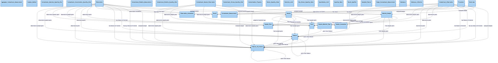

# Verification: transcript MCP resource round-trip

Confirms the `transcript://session/latest` MCP resource serves the complete,
self-contained transcript — fetched through the resource API (not the tool
return), with its embedded diagram still rendering. This is the remote-safe,
hallucination-proof path: the client reads the document directly, independent of
how the model re-emits it.

## Method

1. Run a real `sparql_query` (logged) and `visualize_schema("sawgraph")`
   (logged) against the live endpoint.
2. Call `create_chat_transcript(...)` — renders the markdown and publishes it to
   the resource.
3. Fetch the document via the MCP resource API:
   `read_resource("transcript://session/latest")` (not the tool return value).
4. Extract the ` ```mermaid ` block **from the resource body** and render it with
   `mermaid-cli`.

## Result

- The resource serves `text/markdown`, **8119 bytes**, containing the full
  document — title/provenance, the 👤 **User** / 🧠 **Assistant** conversation,
  the "SPARQL queries executed" section with its result table, and the
  "Schema visualizations" section (sawgraph, **57** inferred edges).
- The mermaid block extracted from the resource body rendered cleanly (exit 0,
  zero syntax-error markers) — the connected sawgraph schema:



- Lifecycle checks: the resource returns a placeholder before any transcript is
  generated, serves the rendered markdown after, and is cleared back to the
  placeholder by `reset_query_log` (covered by the unit tests in
  `tests/test_transcript.py`).

## Reproduce

```python
import asyncio, re
from mcp_okn import server, session

async def main():
    session.reset()
    await server.visualize_schema("sawgraph")
    await server.create_chat_transcript(model="claude-opus-4-8")
    item = list(await server.mcp.read_resource("transcript://session/latest"))[0]
    body = str(getattr(item, "content", item))
    block = re.search(r"```mermaid\n(.*?)\n```", body, re.S).group(1)
    open("res.mermaid", "w").write(block)  # render with mermaid-cli

asyncio.run(main())
```
