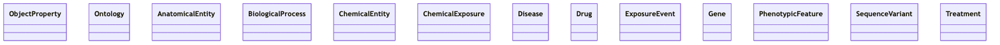
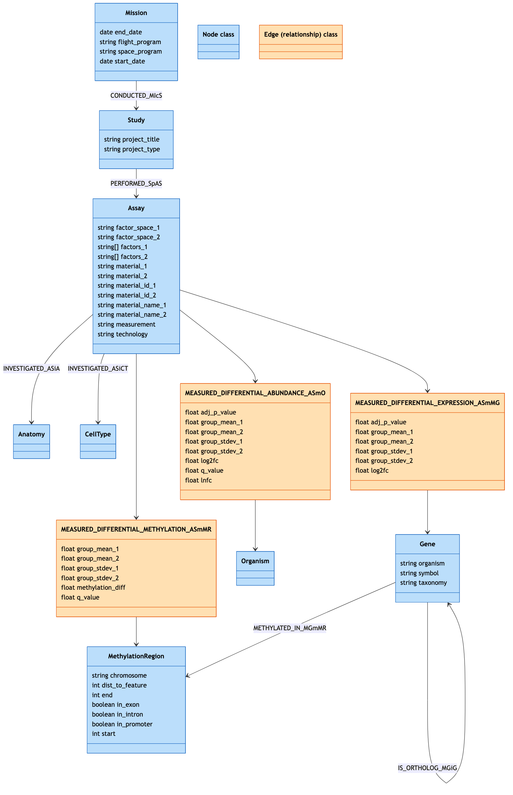

# Verification: visualize_schema renders

Confirms that the Mermaid produced by `visualize_schema` (generated server-side
in `src/mcp_okn/schema.py`) is valid and renders as a class diagram — not just
syntactically plausible text.

## Method

Two KGs covering both shapes the generator produces were rendered through the
real Mermaid engine via `@mermaid-js/mermaid-cli` (headless Chromium):

- `spoke-genelab` — the richest KG: typed node properties, labeled edges, and
  edge predicates with properties.
- `dreamkg` — the class-only case: classes but no `SourceClass`/`TargetClass`
  metadata, so predicates are emitted as `%%` comments instead of edges.
- `rdkg` — the probe fallback: no curated CSV at all, so the schema comes from
  probing the endpoint (bare class/predicate URIs, no labels or endpoints).

```bash
# write the diagram (no fences) to a .mermaid file, then:
npx -y @mermaid-js/mermaid-cli -i spoke-genelab.mermaid -o spoke-genelab.png -s 2
```

## Result — spoke-genelab (edges + edge properties)

- Rendered cleanly — exit 0, valid `classDiagram` SVG/PNG, **zero** syntax-error
  markers.
- Visual layout matches the design:
  - **Class boxes with typed members** — `Mission`, `Study`, `Assay`, `Gene`
    (`string organism/symbol/taxonomy`), `MethylationRegion` (`int`/`boolean`
    fields).
  - **Plain predicates as labeled arrows** — `CONDUCTED_MIcS`, `PERFORMED_SpAS`,
    `INVESTIGATED_ASiA`/`INVESTIGATED_ASiCT`, `METHYLATED_IN_MGmMR`, plus the
    `IS_ORTHOLOG_MGiG` Gene→Gene self-loop.
  - **Edge-property predicates as intermediary classes** with `float` fields,
    wired `source --> edge --> target` — e.g.
    `MEASURED_DIFFERENTIAL_EXPRESSION_ASmMG` between `Assay` and `Gene`,
    `MEASURED_DIFFERENTIAL_ABUNDANCE_ASmO` → `Organism`,
    `MEASURED_DIFFERENTIAL_METHYLATION_ASmMR` → `MethylationRegion`. Node
    (entity) classes are colored **light blue** and edge (relationship) classes
    **orange**, with a **legend** showing both, via per-class `style` statements
    — the form that renders fills in `classDiagram` (a `classDef` + `:::`
    assignment parses but emits no fill).
  - **`direction TB`** yields the intended tall, top-down layout.


## Result — dreamkg (class-only)

dreamkg has 14 schema.org classes but no source/target metadata on its
predicates. The diagram renders cleanly (exit 0, zero syntax-error markers) as:

- **14 class boxes** — `AdministrativeArea`, `Audience`, `CategoryCode`,
  `ContactPoint`, `OpeningHoursSpecification`, `Organization`, `Place`,
  `Service`, `ServiceChannel`, `TextObject`, `WebPage`, `Activity`,
  `Collection`, `Entity`.
- **34 predicates as `%%` comments** (e.g. `address`, `name`, `telephone`),
  which Mermaid ignores — so no edges are fabricated.


## Result — rdkg (probe fallback)

rdkg has no curated CSV, so `get_schema` probes the federation endpoint and
returns bare class/predicate URIs (no labels, no source/target). The generator
derives class names from URI local parts; the diagram renders cleanly (exit 0,
zero syntax-error markers) as:

- **13 class boxes** from probed URIs — `ObjectProperty`, `Ontology`,
  `AnatomicalEntity`, `BiologicalProcess`, `ChemicalEntity`, `ChemicalExposure`,
  `Disease`, `Drug`, `ExposureEvent`, `Gene`, `PhenotypicFeature`,
  `SequenceVariant`, `Treatment`.
- **21 predicates as `%%` comments** (e.g. `comment`, `label`, `prefLabel`) —
  probing yields no endpoints, so no edges are fabricated.



## Result — transcript round-trip (end-to-end)

Confirms a `visualize_schema` diagram survives into `create_chat_transcript` and
still renders — i.e. the diagram is auto-logged to the session and embedded in
the transcript markdown, not dropped.

Steps:

1. `visualize_schema("spoke-genelab")` — logs the diagram to the session.
2. `create_chat_transcript(...)` — emits markdown with a **Schema
   visualizations** section.
3. Extract the ` ```mermaid ` block **from the transcript markdown** (not from
   the tool output) and render it with `mermaid-cli`.

Result: the transcript contained an 81-line mermaid block, which rendered
cleanly (exit 0, zero syntax-error markers) — identical to the standalone
spoke-genelab render above.



## Reproduce

```python
import asyncio
from mcp_okn import schema

m = asyncio.run(schema.visualize_schema("spoke-genelab"))["mermaid"]
open("spoke-genelab.mermaid", "w").write(m)  # then render with mermaid-cli (above)
```

End-to-end transcript round-trip:

```python
import asyncio, re
from mcp_okn import server, session
import mcp_okn.schema as sch

async def main():
    session.reset()
    r = await sch.visualize_schema("spoke-genelab")
    session.record_visualization("spoke-genelab", r["mermaid"])
    md = await server.create_chat_transcript(model="claude-opus-4-8")
    block = re.search(r"```mermaid\n(.*?)\n```", md, re.S).group(1)
    open("from_transcript.mermaid", "w").write(block)  # render with mermaid-cli

asyncio.run(main())
```


```python
import asyncio
from mcp_okn import schema

m = asyncio.run(schema.visualize_schema("spoke-genelab"))["mermaid"]
open("spoke-genelab.mermaid", "w").write(m)  # then render with mermaid-cli (above)
```
