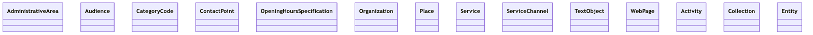

# Verification: visualize_schema renders

Confirms that the Mermaid produced by `visualize_schema` (generated server-side
in `src/mcp_okn/schema.py`) is valid and renders as a class diagram — not just
syntactically plausible text.

## Method

Two KGs covering both shapes the generator produces were rendered through the
real Mermaid engine via `@mermaid-js/mermaid-cli` (headless Chromium):

- `spoke-genelab` — the richest KG: typed node properties, labeled edges, and
  edge predicates with properties.
- `dreamkg` — the class-only case: classes but no `SourceClass`/`TargetClass`
  metadata, so predicates are emitted as `%%` comments instead of edges.

```bash
# write the diagram (no fences) to a .mermaid file, then:
npx -y @mermaid-js/mermaid-cli -i spoke-genelab.mermaid -o spoke-genelab.png -s 2
```

## Result — spoke-genelab (edges + edge properties)

- Rendered cleanly — exit 0, valid `classDiagram` SVG/PNG, **zero** syntax-error
  markers.
- Visual layout matches the design:
  - **Class boxes with typed members** — `Mission`, `Study`, `Assay`, `Gene`
    (`string organism/symbol/taxonomy`), `MethylationRegion` (`int`/`boolean`
    fields).
  - **Plain predicates as labeled arrows** — `CONDUCTED_MIcS`, `PERFORMED_SpAS`,
    `INVESTIGATED_ASiA`/`INVESTIGATED_ASiCT`, `METHYLATED_IN_MGmMR`, plus the
    `IS_ORTHOLOG_MGiG` Gene→Gene self-loop.
  - **Edge-property predicates as intermediary classes** with `float` fields,
    wired `source --> edge --> target` — e.g.
    `MEASURED_DIFFERENTIAL_EXPRESSION_ASmMG` between `Assay` and `Gene`,
    `MEASURED_DIFFERENTIAL_ABUNDANCE_ASmO` → `Organism`,
    `MEASURED_DIFFERENTIAL_METHYLATION_ASmMR` → `MethylationRegion`.
  - **`direction TB`** yields the intended tall, top-down layout.


## Result — dreamkg (class-only)

dreamkg has 14 schema.org classes but no source/target metadata on its
predicates. The diagram renders cleanly (exit 0, zero syntax-error markers) as:

- **14 class boxes** — `AdministrativeArea`, `Audience`, `CategoryCode`,
  `ContactPoint`, `OpeningHoursSpecification`, `Organization`, `Place`,
  `Service`, `ServiceChannel`, `TextObject`, `WebPage`, `Activity`,
  `Collection`, `Entity`.
- **34 predicates as `%%` comments** (e.g. `address`, `name`, `telephone`),
  which Mermaid ignores — so no edges are fabricated.



## Reproduce

```python
import asyncio
from mcp_okn import schema

m = asyncio.run(schema.visualize_schema("spoke-genelab"))["mermaid"]
open("spoke-genelab.mermaid", "w").write(m)  # then render with mermaid-cli (above)
```
